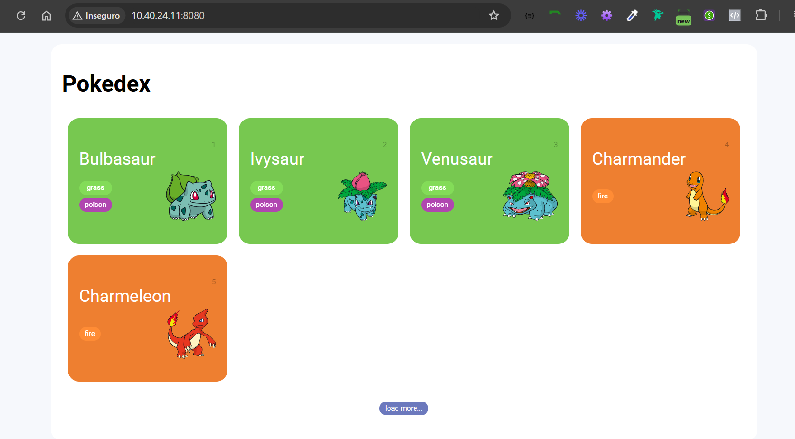

# Pokédex



## 📖 Descrição

Este é um projeto de estudo desenvolvido com HTML, CSS e JavaScript. A Pokédex utiliza a [PokeAPI](https://pokeapi.co/) para exibir dados sobre diferentes Pokémon, aplicando conceitos de **Fetch API** para consumir dados externos e **paginação** com um único botão para navegação contínua.

## 🗂️ Tabela de Conteúdos

- [Descrição](#descrição)
- [Instalação](#instalação)
- [Uso](#uso)
- [Funcionalidades](#funcionalidades)
- [Tecnologias Utilizadas](#tecnologias-utilizadas)
- [Contribuição](#contribuição)
- [Licença](#licença)

## 🚀 Instalação

1. Clone este repositório:

   ```bash
   git clone https://github.com/ClaytonEduard/POKEDEX.git
   ```
2. Navegue até o diretório do projeto:
   ```bash
   cd POKEDEX
   ```
3. Abra o arquivo index.html no seu navegador para visualizar o projeto.

# 📋Uso

    Ao abrir o arquivo index.html, a Pokédex exibe uma lista inicial de Pokémon carregada da PokeAPI. Use o botão de paginação para navegar e carregar mais Pokémon na mesma página.

# 🌟Funcionalidades

- Consumo da API: Utiliza o método <code>fetch()</code>para obter dados da [PokeAPI](https://pokeapi.co/).
- Paginação contínua: Um único botão permite carregar mais Pokémon na mesma página, sem necessidade de redirecionamento.
- Design responsivo: Interface ajustada para uma boa visualização em diferentes dispositivos.

# 🛠️Tecnologias Utilizadas

- HTML5: Estrutura da aplicação.
- CSS3: Estilização e layout.
- JavaScript: Lógica da aplicação, consumo da API e paginação.

# 🤝Contribuição

Contribuições são bem-vindas! Sinta-se à vontade para abrir uma [issue](https://github.com/ClaytonEduard/POKEDEX/issues) para sugestões de melhorias ou reportar bugs. Para contribuir com o código:

1. Faça um fork do projeto.

2. Crie uma nova branch para sua feature:

   ```bash
   git checkout -b feature/nome-da-feature

   ```

3. Comite suas alterações:
   ```bash
   git commit -m "Descrição da feature"
   ```
4. Envie para o repositório remoto:
   ```bash
   git push origin feature/nome-da-feature
   ```
5. Abra um Pull Request no repositório principal.

##

<h1>Obrigado!!!!!!</h1>
